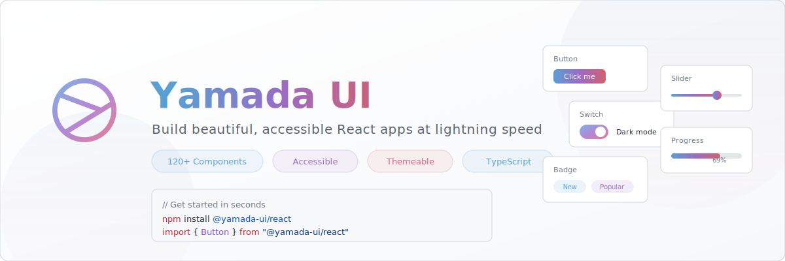

<p align="center">
  <picture>
    <source media="(prefers-color-scheme: dark)" srcset="./assets/readme/hero-banner.svg" />
    <source media="(prefers-color-scheme: light)" srcset="./assets/readme/hero-banner-light.svg" />
    
  </picture>
</p>

<p align="center">
  <a href="https://www.npmjs.com/package/@yamada-ui/react"></a>
  <a href="https://www.npmjs.com/package/@yamada-ui/react"></a>
  <a href="https://github.com/yamada-ui/yamada-ui/blob/main/LICENSE"></a>
  <a href="https://github.com/yamada-ui/yamada-ui"></a>
  <a href="https://discord.gg/H7V5RfEDTR"></a>
</p>

<p align="center">
  <a href="./README.md">English</a> | 日本語
</p>

---

## Yamada UIとは？

**Yamada UI**は、**120以上のプロダクションレディなコンポーネント**、**34以上のフック**、高度なスタイリングシステムを備えた包括的なReactデザインシステムです。アクセシビリティ、テーマ、開発者体験をコア原則として構築されています。

```tsx
import { Button, Center, Heading } from "@yamada-ui/react"

function App() {
  return (
    <Center h="100vh" flexDirection="column" gap="md">
      <Heading>Yamada UIへようこそ</Heading>
      <Button colorScheme="primary">はじめる</Button>
    </Center>
  )
}
```

## 特徴

<table>
<tr>
<td width="50%">

### 120以上のコンポーネント
ボタン、モーダル、フォーム、チャート、カルーセル、カレンダー、カラーピッカー、データテーブルなど、プロダクションアプリに必要なすべてが揃っています。

</td>
<td width="50%">

### デフォルトでアクセシブル
WAI-ARIA準拠。キーボードナビゲーション、スクリーンリーダーサポート、フォーカス管理がすべてのコンポーネントに組み込まれています。

</td>
</tr>
<tr>
<td width="50%">

### パワフルなテーマ
カラー、スペーシング、タイポグラフィ、コンポーネントスタイルをグローバルまたはコンポーネント単位でカスタマイズ。ダークモード対応。

</td>
<td width="50%">

### TypeScriptファースト
すべてのprops、テーマトークン、スタイル値に完全な型安全性とオートコンプリートを提供。追加設定は不要です。

</td>
</tr>
<tr>
<td width="50%">

### スタイルProps
すべてのコンポーネントでレスポンシブでテーマ対応のスタイルpropsが使えます。保守性を犠牲にせずインラインでスタイルを記述できます。

</td>
<td width="50%">

### 34以上のカスタムフック
`useAnimation`、`useBreakpoint`、`useClipboard`、`useColorMode`、`useDisclosure`など、すぐに使えるユーティリティが豊富に用意されています。

</td>
</tr>
</table>

## クイックスタート

### インストール

```bash
npm install @yamada-ui/react
```

### セットアップ

アプリケーションを`UIProvider`でラップします：

```tsx
import { UIProvider } from "@yamada-ui/react"

function App() {
  return (
    <UIProvider>
      <YourApp />
    </UIProvider>
  )
}
```

### コンポーネントを使う

```tsx
import {
  Button,
  Card,
  CardBody,
  CardHeader,
  Heading,
  Text,
} from "@yamada-ui/react"

function MyCard() {
  return (
    <Card>
      <CardHeader>
        <Heading size="md">Yamada UI</Heading>
      </CardHeader>
      <CardBody>
        <Text>React用の美しくアクセシブルなコンポーネント。</Text>
        <Button colorScheme="primary" mt="md">
          詳しく見る
        </Button>
      </CardBody>
    </Card>
  )
}
```

## コンポーネントカテゴリ

| カテゴリ | コンポーネント |
|----------|---------------|
| **レイアウト** | Box, Flex, Grid, Stack, Center, Container, AspectRatio, ... |
| **フォーム** | Input, Checkbox, Radio, Select, Switch, Slider, DatePicker, ColorPicker, ... |
| **データ表示** | Table, Card, Badge, Tag, List, Timeline, Stat, ... |
| **フィードバック** | Alert, Progress, Skeleton, Loading, Toast, ... |
| **オーバーレイ** | Modal, Drawer, Popover, Tooltip, Menu, ... |
| **ナビゲーション** | Tabs, Breadcrumb, Pagination, Link, Steps, ... |
| **メディア** | Image, Avatar, Carousel, QRCode, ... |
| **モーション** | Fade, Slide, Collapse, カスタムアニメーション, ... |
| **チャート** | Line, Bar, Area, Pie, Radar、ビルトインチャートコンポーネント |

## ドキュメント

完全なドキュメント、ガイド、サンプルは **[yamada-ui.com](https://yamada-ui.com/ja)** をご覧ください。

## リスペクト

Yamada UIは、[Chakra UI](https://github.com/chakra-ui/chakra-ui)、[shadcn/ui](https://github.com/shadcn-ui/ui)、[MUI](https://github.com/mui/material-ui)、[Mantine](https://github.com/mantinedev/mantine)から多くのインスピレーションを得ています。これらのプロジェクトとその制作者の方々に深く感謝しています。

## サポートする

Yamada UIが役に立ったと感じたら、GitHubでスターをつけてください。私たちの成長とライブラリの改善に繋がります。

ぜひ、このプロジェクトをサポートしてください！ [[貢献する](https://opencollective.com/yamada-ui/contribute)]

### 組織

<a href="https://opencollective.com/yamada-ui"></a>

<a href="https://vercel.com/oss"></a>

### 個人

<a href="https://opencollective.com/yamada-ui"></a>

## 貢献する

貢献したいと思いませんか？ それは、とても素晴らしいことです！

あなたを支援するために[ガイドライン](./CONTRIBUTING.ja.md)を準備しています。

もし、ドキュメントへの貢献に興味がある場合は、こちらの[ガイドライン](https://yamada-ui.com/ja/community/contributing)を参照してください。

## ライセンス

MIT © [Hirotomo Yamada](https://github.com/hirotomoyamada)
