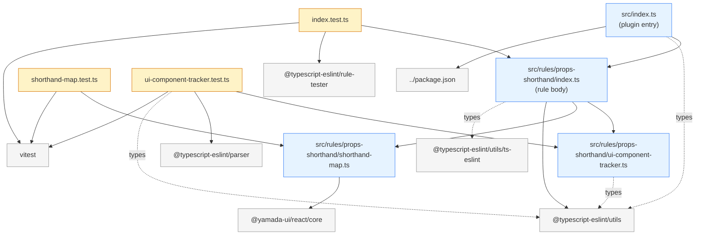

# `@yamada-ui/lint` Dependency Graph

`packages/lint/src/` 配下のファイル間依存関係と、各ファイルが利用している外部パッケージをまとめたドキュメントです。

## プロダクションコードの依存ツリー

```
              src/index.ts                          (plugin entry / default export)
                    │
                    │ propsShorthand
                    ▼
       src/rules/props-shorthand/index.ts           (rule body)
                    │
         ┌──────────┴───────────────────┐
         │ createUI                     │ getShorthand
         │ ComponentTracker             │ Map
         ▼                              ▼
src/rules/props-shorthand/     src/rules/props-shorthand/
ui-component-tracker.ts        shorthand-map.ts
                                        │
                                        │ shorthandStyles,
                                        │ standardStyles
                                        ▼
                               @yamada-ui/react/core (peer)
```

## ファイルごとの依存（テーブル）

### `src/index.ts` （plugin entry）

| Import 先                  | 種類              | 用途                                             |
| -------------------------- | ----------------- | ------------------------------------------------ |
| `@typescript-eslint/utils` | external (型のみ) | `TSESLint.FlatConfig.Plugin` / `Config` の型注釈 |
| `../package.json`          | external (JSON)   | `meta.name` / `meta.version` のソース            |
| `./rules/props-shorthand`  | internal          | ルール本体を辞書に登録するため                   |

### `src/rules/props-shorthand/index.ts` （rule body）

| Import 先                            | 種類              | 用途                                                |
| ------------------------------------ | ----------------- | --------------------------------------------------- |
| `@typescript-eslint/utils`           | external          | `TSESTree`（型）+ `ESLintUtils.RuleCreator`（実体） |
| `@typescript-eslint/utils/ts-eslint` | external (型のみ) | `RuleModule` の型注釈                               |
| `./ui-component-tracker`             | internal          | Yamada UI 由来の JSX タグを判定                     |
| `./shorthand-map`                    | internal          | shorthand ⇄ longhand の対応マップ                   |

### `src/rules/props-shorthand/ui-component-tracker.ts`

| Import 先                  | 種類              | 用途                       |
| -------------------------- | ----------------- | -------------------------- |
| `@typescript-eslint/utils` | external (型のみ) | `TSESTree`（AST ノード型） |

### `src/rules/props-shorthand/shorthand-map.ts`

| Import 先               | 種類            | 用途                                            |
| ----------------------- | --------------- | ----------------------------------------------- |
| `@yamada-ui/react/core` | external (peer) | `shorthandStyles` / `standardStyles` の元データ |

## テストの依存

```
src/rules/props-shorthand/index.test.ts
    ├── ./index                        (propsShorthand 本体)
    ├── @typescript-eslint/rule-tester (RuleTester)
    └── vitest                         (afterAll, describe, it)

src/rules/props-shorthand/shorthand-map.test.ts
    ├── ./shorthand-map (getShorthandMap)
    └── vitest          (describe, expect, test)

src/rules/props-shorthand/ui-component-tracker.test.ts
    ├── ./ui-component-tracker      (createUIComponentTracker)
    ├── @typescript-eslint/utils    (型 TSESTree)
    ├── @typescript-eslint/parser   (parse)
    └── vitest                      (describe, expect, test)
```

## 凡例

- **internal**: `packages/lint/src/` 内部のファイル
- **external**: 別パッケージ（`peerDependencies` / `dependencies` / `devDependencies` のいずれか）
- **型のみ**: `import type { ... }` で型情報だけ取り込み、ランタイムには残らない
- **peer**: `peerDependencies` で宣言され、ユーザー側にインストールが委ねられる依存

## 観察ポイント

1. **依存方向は常に親 → 子**
   `index.ts` → `rules/.../index.ts` → `rules/.../{ui-component-tracker,shorthand-map}.ts`。逆方向の依存はなく、コロケーション原則を満たしている。

2. **`ui-component-tracker` は `props-shorthand` ルールにコロケーション**
   現状の消費者は `props-shorthand` の 1 つだけなので、`rules/props-shorthand/` 配下に置く。別ルールから利用したくなった時点で `src/utils/` に昇格させる。

3. **`shorthand-map` も `props-shorthand` ルール専用**
   `rules/props-shorthand/` 配下にコロケーション。他ルールで shorthand マップが必要になったら `src/utils/` に昇格させる動機が出る。

4. **`@yamada-ui/react/core` が唯一の workspace 依存**
   公式の shorthand 定義を `@yamada-ui/react` 本体から借りているので、本体側で対応が増えれば lint も自動追従する設計。

5. **テストは全部 sibling テスト**
   各 `.ts` の隣に `.test.ts` を置く配置。クロスファイルテストはないので、テスト追加時の影響範囲も小さい。

---

## 補足: Mermaid 版（レンダリングできるビューア用）

GitHub 上で開いた場合や、VS Code に Mermaid 拡張を入れている場合は、以下のブロックが図として表示されます。



レンダリングできない環境の場合は、上の「プロダクションコードの依存ツリー」とテーブルを参照してください。
